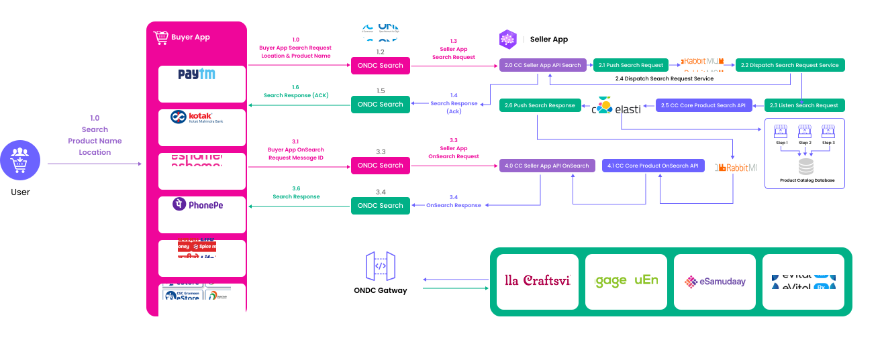
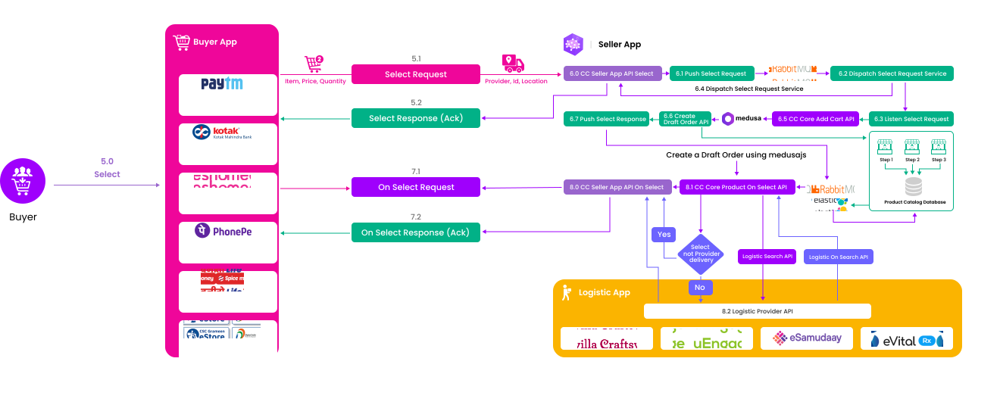
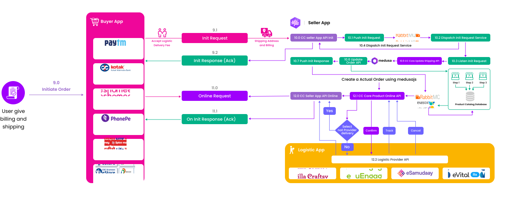

## Search:

- 1.0  User has to search the product name and location given to the buyer app.
- 1.1  Buyer app pass the product name and location to the ONDC Gateway
- 1.2 ONDC Broadcast the requested product based on the location of the seller who is located on the nearest on sellers .
- 1.3  The search request hit our care commerce seller API.
- 1.4  Care commerce search API will pass the ack to the ONDC gateway.
- 1.5   ONDC Gateway passes the Acknowledgement to the Buyer APP.
- 2.0  Care commerce seller app search API receives the request of the buyer app. 
- 2.1   Push the Search request to the RabbitMQ queue
- 2.2  Dispatch the search request if we have the product pass the positive ack to the buyer otherwise pass the negative ack.
- 2.3   Our listener service will listen if we get the search request.
- 2.4   Care commerce core Search API will query the Elastic search, 
- 2.6   Get the product from our catalog and pass the response to RabbitMQ.
- 3.1  If positive ack receive the buyer app it will initiate the on_search API 
- 3.2   ONDC Gateway will pass the request Care commerce on_search API.
- 3.3   Care commerce Seller api will pass the response to the ONDC gateway
- 3.4 ONDC gateway pass the response to the Buyer App.
- 4.0  Care commerce API will pass the request to the Carecommerce core API.
- 4.1  Care commerce core on_search API will get the response from the RabbitMQ queue and pass it to the care commerce      on_search API.

## Select:
After receiving the list of products from the search response, the user needs to select the products he or she wants to buy.

- 5.0 The user needs to select the products from the list of products.
- 5.1 The selected products have to be passed from the buyer app to the seller app. Note that ONDC will not interfere.
- 5.2 Send a positive/negative acknowledgment to the buyer app.
- 6.0 The Care Commerce seller API will receive the user-selected products.
- 6.1 Push the selected product response to the RabbitMQ Queue.
- 6.2 The dispatch service will give a positive acknowledgment to the buyer if the user accepts the price condition. If not, send a negative acknowledgment.
- 6.3 The listener service will listen if the request is received by the RabbitMQ.
- 6.4 Send an acknowledgment (positive/negative) to the buyer app based on the user's needs.
- 6.5 The Care Commerce core API will receive the response and make the order on the Medusajs Application.
- 6.6 When calling the Medusajs API to create the draft order on the Medusajs.
- 6.7 After creating the order, the response will be pushed into the RabbitMQ.
- 7.1 When the buyer app receives the acknowledgment, it will call the on_select API to place the order.
- 7.2 Get the acknowledgment response of the selected product for further processing.
- 8.0 The Care Commerce seller API calls the logistic API to check the logistic availability for the order.
- 8.1 The Care Commerce core API also checks with the logic search API to select the best logistics provider.
- 8.2 The logistic API contains the search API of logistics, which will return the list of logistics providers.

## Init:

initializing the order of selected products

- 9.0 The user will click the checkout button to initiate the order for the selected products.
- 9.1 Initialize the order and pass it to the Care Commerce seller API.
- 9.2 Pass a positive/negative acknowledgment to the Buyer App.
- 10.0 The Care Commerce seller API receives the request to initialize the order for the selected products.
- 10.1 Push the request to the RabbitMQ.
- 10.2 The dispatch service will send a positive/negative acknowledgment to the Buyer App.
- 10.3 The listener service will listen for new order initialization requests.
- 10.4 Pass the acknowledgement to the Buyer App.
- 10.5 The Care Commerce core API will call the Medusajs Shipping API to add the shipping address details.
- 10.6 Call the Medusajs order API to update the details.
- 10.7 Push the response of the order API to RabbitMQ.
- 11.0 The Buyer App will call the on_init API based on the positive/negative acknowledgment.
- 11.1 Pass the on_init response to the Buyer App.
- 12.0 The Care Commerce core API will receive the response from the core API and the logistic API, build the response, and pass it to the Buyer App.
- 12.1 The Care Commerce core API will handle the payment details from the user and check with the logistic provider to place the order.
- 12.2 The Care Commerce core API will check the logistic API to ship the product from the seller to the buyer.

## Confirm:

