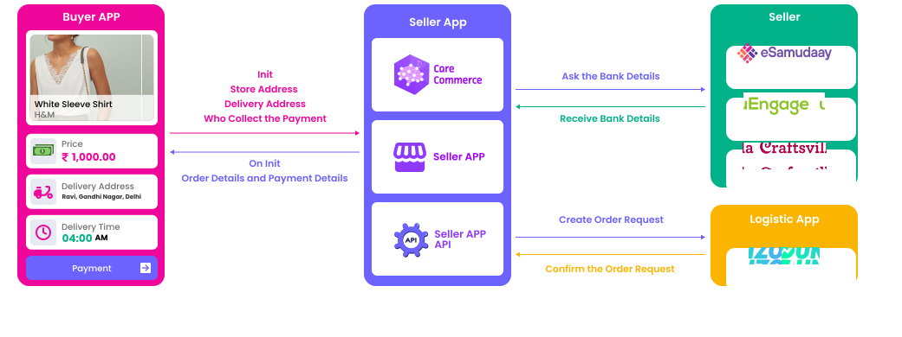
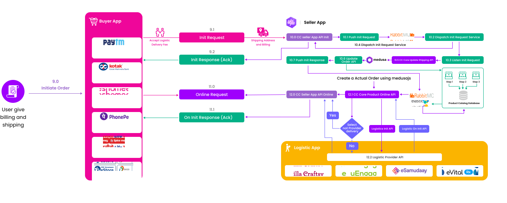

## About API :

OnSelect API helps to get the Quotation of the products in the Cart,
Once the Buyer Agrees to buy the products, Using this init API Order can
be Checkout in the Buyer Application.

Using the Init API, Buyer can instantly confirm the order. By using the
Init API, the seller places the order at the price declared by the buyer
for the quantity specified by the buyer. Init API sends the Order
Initialization request and Checks for the seller approval for acceptance
or rejection of the order by the seller.

## API Overview Diagram:



```json
Method:               POST
Required Parameters:  Need item_details,quote_details,provider_details,fulfillments_details
Url: 			      /protocol/v1/init
Description: 		  init API helps the buyer to place the Order in the Cart of the Buyer Application.
. The user should also be able to change the quantity of items or remove the items from the cart
```

## Flow Diagram of Select and On_Select



## Request Sample Data:

```json
{
  "context": {
    "domain": "nic2004:52110",
    "country": "IND",
    "city": "std:080",
    "core_version": "1.0.0",
    "action": "init",
    "bap_id": "carecommerce.in",
    "bap_uri": "https://carecommerce.in/ondc/1.0/",
    "bpp_id": "carecommerce.in",
    "bpp_uri": "https://carecommerce.in/ondc/v1/148762/bpp",
    "transaction_id": "9b023f42-8532-4aa0-9f13-6cc909f1ae95",
    "message_id": "822480a8-797d-4950-8eae-291e4b7b0341",
    "timestamp": "2022-11-17T12:36:04.230Z",
    "ttl": "PT30S"
  },
  "message": {
    "order": {
      "provider": {
        "id": "111863",
        "locations": [
          {
            "id": 148273
          }
        ]
      },
      "items": [
        {
          "id": "42602097",
          "quantity": {
            "count": 1
          },
          "fulfillment_id": "1"
        }
      ],
      "billing": {
        "name": "Test",
        "address": {
          "name": "560016 Bengaluru Bengaluru Urban",
          "city": "Bengaluru",
          "state": "Karnataka",
          "country": "IN",
          "area_code": "560016"
        },
        "email": "test@gmail.com",
        "phone": "+911234567890"
      },
      "fulfillments": [
        {
          "type": "Delivery",
          "tracking": false,
          "end": {
            "location": {
              "gps": "13.01659,77.68040",
              "address": {
                "name": "560016 Bengaluru Bengaluru Urban",
                "city": "Bengaluru",
                "state": "Karnataka",
                "country": "IN",
                "area_code": "560016"
              }
            },
            "contact": {
              "phone": "+911234567890",
              "email": "test@gmail.com"
            }
          },
          "id": "1"
        }
      ],
      "payment": {
        "collected_by": "BAP",
        "@ondc/org/collected_by_status": "Assert",
        "type": "ON-ORDER"
      }
    }
  }
}
```

## Response Sample Data:

```json
{
    "context": {
        "domain": "nic2004:52110",
        "country": "IND",
        "city": "std:044",
        "action": "init",
        "core_version": "1.0.0",
        "bap_id": "carecommerce.in",
        "bap_uri": "https://carecommerce.in/protocol/v1",
        "transaction_id": "ea2766e0-357c-4add-88c8-f6c5f64a170c",
        "message_id": "37fd9c02-0f8b-4a3e-8397-b9ea64258c57",
        "timestamp": "2022-11-24T07:31:47.870Z",
        "ttl": "PT30S"
    },
    "message": {
        "ack": {
            "status": "ACK"
        }
    }
```

## On_Init API:

OnInit API is the response for the Init API, which has the status of the
Seller's Approval for the Order.

Once the Init API is invoked for the Order Creation as a Send request ,
OnInit API sends the response of the seller's approval for acceptance or
rejection of the order. An order shall be automatically rejected if the
seller does not act within the predefined time frame for approval by the
seller or the same happen if the seller manually rejects the order
request.

If the seller accepts the buyer's Order request from Init API,Buy may
have a status of Order acceptance.

No Response by Seller - Order Auto Rejected Seller accepts Order - Order
Acceptance Status Seller rejects Order - Order Rejection Status

```bash
Method:               POST
Required Parameters:   Need items details,billing details,fulfillments details,quote details,Payment details
Url: 			      /protocol/v1/on_init
Description: 		  The seller node receives a search query and based on the request, it identifies matching items from the various seller catalogs on the platform. It consolidates all matching results and returns a list of items
```

## Request Sample Data

```json
messageId=37fd9c02-0f8b-4a3e-8397-b9ea64258c57

```

## Response Sample Data

```json
{
  "context": {
    "action": "on_init",
    "bap_id": "beta.mystore.in",
    "bap_uri": "https://beta.mystore.in/ondc/1.0/",
    "bpp_id": "buy.sellmore.app",
    "bpp_uri": "https://buy.sellmore.app/ondc/v1/148762/bpp/",
    "city": "std:080",
    "core_version": "1.0.0",
    "country": "IND",
    "domain": "nic2004:52110",
    "message_id": "822480a8-797d-4950-8eae-291e4b7b0341",
    "timestamp": "2022-11-17T12:36:05.198Z",
    "transaction_id": "9b023f42-8532-4aa0-9f13-6cc909f1ae95",
    "ttl": "PT30S"
  },
  "message": {
    "order": {
      "billing": {
        "address": {
          "area_code": "560016",
          "city": "Bengaluru",
          "country": "IN",
          "name": "560016 Bengaluru Bengaluru Urban",
          "state": "Karnataka"
        },
        "email": "test@gmail.com",
        "name": "Test",
        "phone": "+911234567890"
      },
      "fulfillments": [
        {
          "end": {
            "contact": {
              "email": "test@gmail.com",
              "phone": "+911234567890"
            },
            "location": {
              "address": {
                "area_code": "560016",
                "city": "Bengaluru",
                "country": "IN",
                "name": "560016 Bengaluru Bengaluru Urban",
                "state": "Karnataka"
              },
              "gps": "13.01659,77.68040"
            }
          },
          "id": "1",
          "tracking": false,
          "type": "Delivery"
        }
      ],
      "items": [
        {
          "fulfillment_id": "1",
          "id": "42602097",
          "quantity": {
            "count": 1
          }
        }
      ],
      "payment": {
        "@ondc/org/buyer_app_finder_fee_amount": "3",
        "@ondc/org/buyer_app_finder_fee_type": "fixed",
        "@ondc/org/return_window": "0",
        "@ondc/org/settlement_basis": "Collection",
        "@ondc/org/settlement_details": [
          {
            "bank_name": "",
            "beneficiary_name": "",
            "branch_name": "",
            "settlement_bank_account_no": "123121311",
            "settlement_counterparty": "seller-app",
            "settlement_ifsc_code": "ICICI0001",
            "settlement_phase": "sale-amount",
            "settlement_type": "neft",
            "upi_address": ""
          }
        ],
        "@ondc/org/settlement_window": "P2D",
        "@ondc/org/withholding_amount": "0.00",
        "collected_by": "BAP",
        "type": "ON-ORDER"
      },
      "provider": {
        "id": "111863"
      },
      "provider_location": {
        "id": null
      },
      "quote": {
        "breakup": [
          {
            "@ondc/org/item_id": "42602097",
            "@ondc/org/item_quantity": {
              "count": 1
            },
            "@ondc/org/title_type": "item",
            "item": {
              "price": {
                "currency": "INR",
                "value": 99
              },
              "quantity": {
                "available": {
                  "count": "100"
                },
                "maximum": {
                  "count": "100"
                }
              }
            },
            "price": {
              "currency": "INR",
              "value": 99
            },
            "title": "Butter milk Amul"
          },
          {
            "@ondc/org/item_id": "",
            "@ondc/org/title_type": "delivery",
            "price": {
              "currency": "INR",
              "value": 23
            },
            "title": "Delivery charges"
          },
          {
            "@ondc/org/item_id": "",
            "@ondc/org/title_type": "packing",
            "price": {
              "currency": "INR",
              "value": 25
            },
            "title": "Packing charges"
          }
        ],
        "price": {
          "currency": "INR",
          "value": "147.0"
        },
        "ttl": "P1D"
      }
    }
  }
}
```
