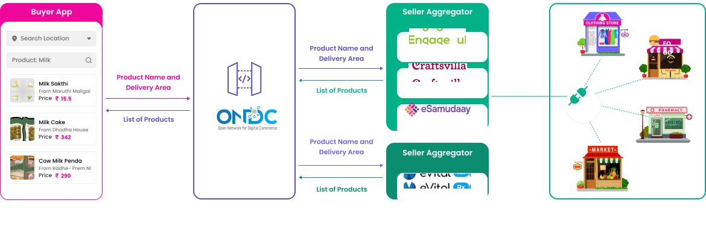
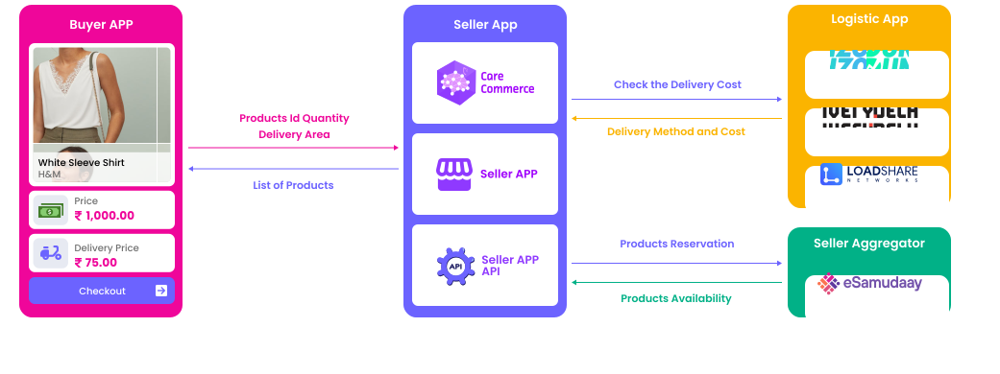
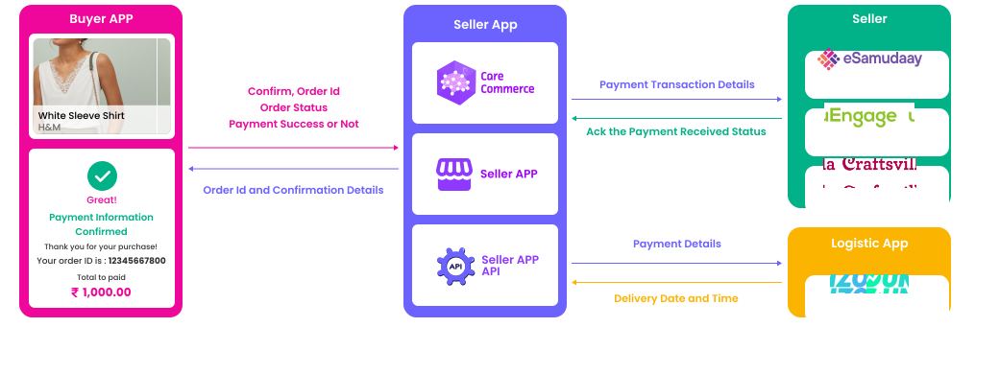

## Use Case for Search:

Ramesh wants to buy 100ml of Milk using the Buyer App, He searches the product using the product name, Using Search API to discover the product based on Ramesh's specific location from the large network of seller available in the ONDC

## Use Case for Select:

Ramesh uses the search API response to select products and adds them to his cart. Later on, he can modify the list of products in his cart by adding or removing items as needed. It is important to note that ONDC will not be involved in any interactions between the buyer and seller after the search API. ONDC only facilitates the initial handshake between the buyer and seller during the search API process.

## Use case for Init:

In order to place the order on the buyer app, Ramesh needs to proceed with payment. However, before doing so, he must provide his billing and shipping address. This is necessary to ensure that the products can be delivered to the correct location. Ramesh must accept the delivery charges and any additional charges that may apply before completing his order.

## Use case for Confirm:
 
Once Ramesh has selected the products and provided his billing and shipping address, he can proceed to order the products with a single click. After he has made the payment successfully, the order will be placed successfully. This means that the seller will receive the order details and can begin processing it. It is important for Ramesh to ensure that he has reviewed his order carefully before completing the purchase, as any errors or issues may result in delays or additional charges. However, assuming that everything is in order, Ramesh can expect to receive his products within the specified delivery timeframe.

