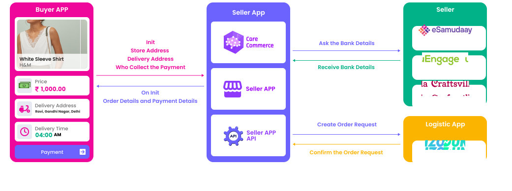

## Use Case for Search:

Ramesh wants to buy 100ml of milk through the buyer app. He searches for the product by product name and uses the Search API to find the product by Ramesh's specific location in the vast network of sellers available on the ONDC

## Use Case for Select:

Ramesh uses the Search API response to select products and add them to his shopping cart. Later, he can change the product list in his shopping cart by adding or removing items as needed. It is important to note that after the Search API, ONDC is not involved in any buyer-seller interactions. ONDC only facilitates the first handshake between buyer and seller during the search API process.

## Use case for Init:

To place the order in the buyer app, Ramesh needs to proceed with the payment. Before doing so, however, he must provide his billing and delivery address. This is necessary to ensure that the products can be delivered to the right place. Ramesh must accept the shipping cost and any additional charges that may apply before completing his order.

## Use case for Confirm:
 
Once Ramesh has selected the products and provided his billing and shipping address, he can proceed to order the products with a single click. After he successfully completed the payment, the order will be placed successfully. This means that the seller receives the order details and can start processing. It is important for Ramesh to ensure he has reviewed his order carefully before completing the purchase as any errors or issues could result in delays or additional charges. However, provided everything is in order, Ramesh can expect to receive its products within the stated delivery time.

